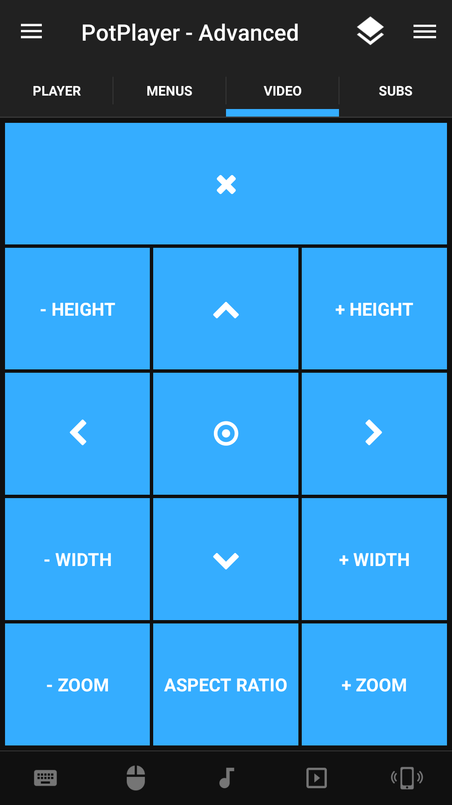

# Daum PotPlayer
Daum PotPlayer advanced custom remote control.

## Features

### Main
* Display currently playing file
* Lower Volume | Mute Volume | Rise Volume
* Jump back 5 seconds | Start/Pause video | Jump forward 5 seconds
* Jump forward 30 seconds | Full Screen | Jump back 30 seconds
* Next track | Previous track

### Menus
* Close the current menu or dialog
* Open Audio Stream | Move Up | Open Video Stream
* Move Left | Enter/Apply | Move Right
* Open File | Move Down | Open Folder
* Settings Menu | Show/Hide OSD | Options Menu

### Videos
* Reset all video settings
* Decrease the height of the video | Move the video up | Increase the height of the video
* Move the video left | Move the video to the center | Move the video right
* Decrease the width of the video | Move the video down | Increase the width of the video 
* Zoom out the video | Change the aspect ratio | Zoom in the video

### Subs
* Show / Hide subtitles
* Slower subtitle sync | Move the subtitles up | Faster subtitle sync
* Move the subtitles left | Reset subtitle movement | Move the subtitles righ
* Increase subtitles size | Move the subtitles down | Decrease subtitles size
* Decrease width spacing | Increase width spacing | Decrease height spacing | Increase height spacing

## Screenshots
   
